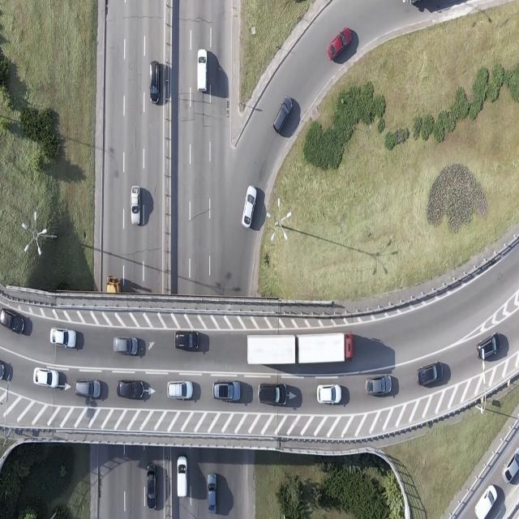
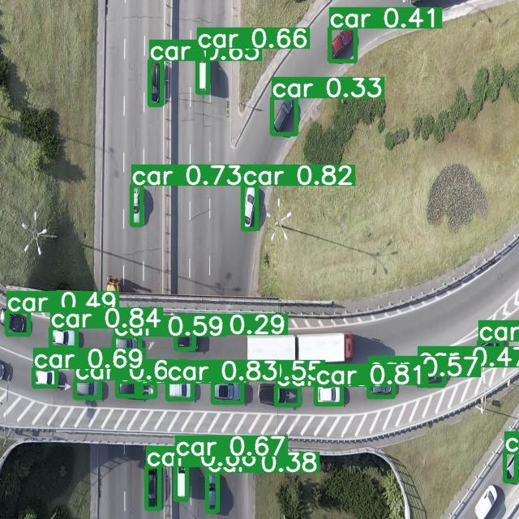

# Vehicle Detection using YOLOv9

This repository contains a YOLOv9-based vehicle detection system that identifies **11 classes** for cars and **10 additional vehicle types**, including bicycles, trucks, buses, pedestrians, and more.


## Features
- **Real-time vehicle detection** using the state-of-the-art YOLOv9 model.
- **11 vehicle classes** including cars, bicycles, trucks, buses, pedestrians, and more.
- **Streamlit frontend** for user interaction.
- **FastAPI backend** for model inference.

## Getting Started

### Prerequisites
- Docker
- Python 3.9+

### Setup

1. Clone the repository:
   ```bash
   git clone https://github.com/Hamza-Shafee-Aldaghstany/pmlyolo9.git
   cd pmlyolo9
Build the Docker images:

For the backend (FastAPI + YOLOv9 model):

bash
docker build -t yolov9-backend -f deployment/api/Dockerfile .
For the frontend (Streamlit):

bash
docker build -t yolov9-frontend -f deployment/app/Dockerfile .
Run the containers:

bash
docker-compose up
This will start both the backend and frontend services.

Usage
Access the frontend via Streamlit to interact with the model.
The backend exposes a FastAPI service for performing inference.
Dataset
The dataset used for training the model consists of various vehicle types and is publicly available. You can download the dataset from the following link:

Dataset for Vehicle Detection
https://universe.roboflow.com/teknofestproject/aerial-view-vehicle-detection

YOLOv9 Model Weights
After downloading, place the weights file in the appropriate directory before running the backend.
https://drive.google.com/drive/folders/171w8iZwVY5YU4LYGaYnJmb1nblyWIcf7?usp=sharing

Model Architecture
The model used is based on YOLOv9, with 11 car classes and 10 other vehicle-related classes. The detection system is highly optimized for real-time performance.

The YOLOv9 model implementation is based on the paper and code available at this repository. This advanced model architecture ensures efficient detection of different vehicle types.

Docker Setup
Backend
The backend is powered by FastAPI and uses the YOLOv9 model for real-time inference. You can build and deploy the backend using the following Dockerfile:

Dockerfile


The frontend is built using Streamlit to provide a simple, interactive interface.
